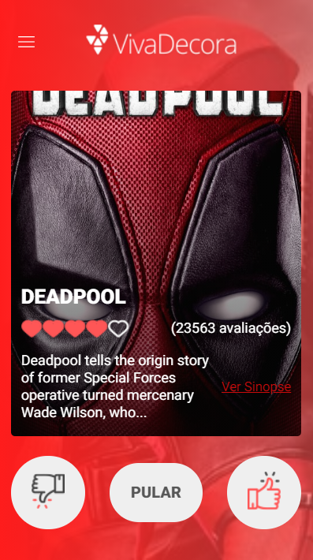
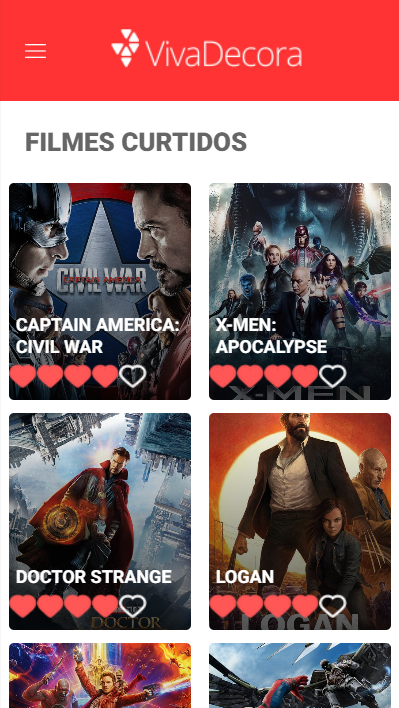
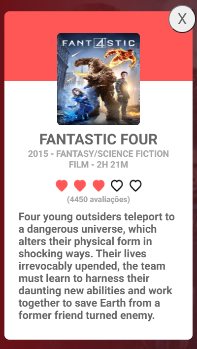
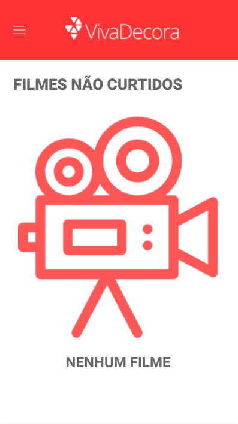
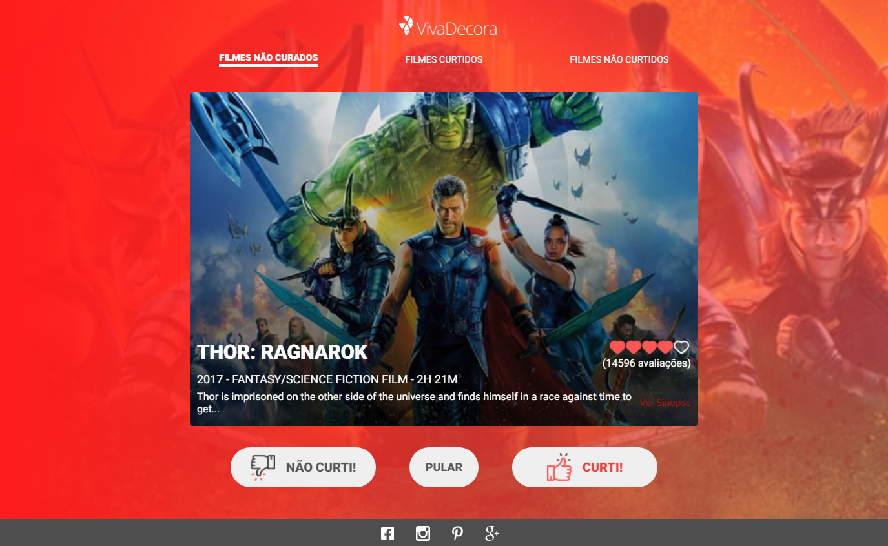
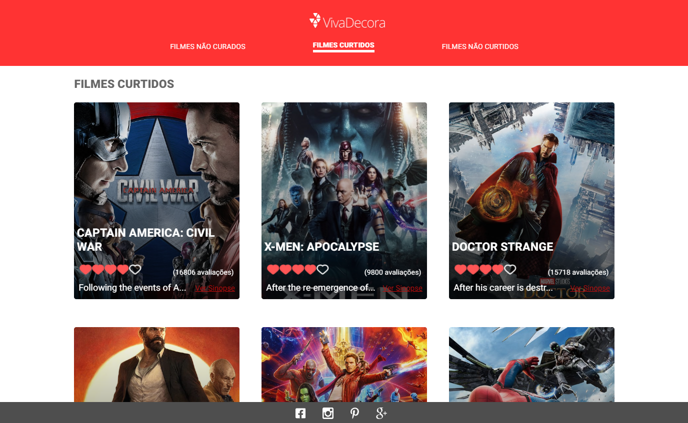
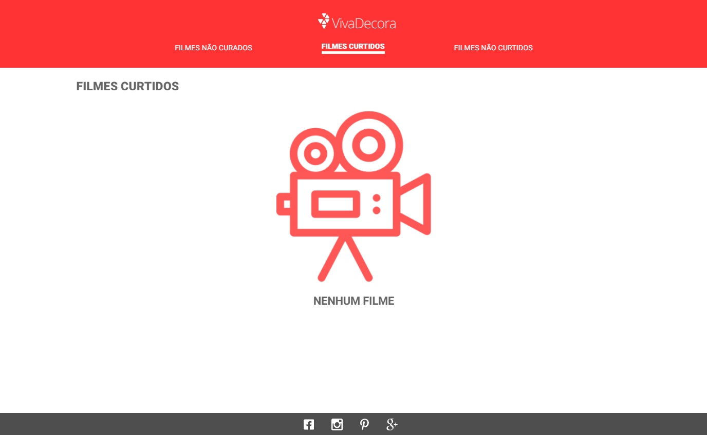

<p align="center">
  
</p>

<p align="center">
  
</p>

<h1 align="center">
 <a href="#capturas">Capturas</a> •
 <a href="#requisitos">Pré-requisitos</a> • 
 <a href="#rodando">Rodando o projeto</a> • 
 <a href="#tecnologias">Tecnologias</a> • 
 <a href="#autor">Autor</a> • 
 <a href="#licenc-a">Licença</a>

</h1>

<h4 align="center"> 
	Projeto em produção pelo Netlify em: <a href="silly-pare-c55a4b.netlify.app" target="_blank">Curadoria de Filmes - Viva Decora</a>  
</h4>

# Recursos

- [x] Lista filmes da API The Movies Database
- [x] Possibilita curtir, pular e não curtir os filmes
- [x] Possui páginas que listam os filmes curtidos e não curtidos

<h1 id="capturas">
	Capturas de Tela
</h1>

<h4>
	Mobile
</h4>

<h1 align="center" >
  
  
  
  
</h1>

<h4>
	Web
</h4>

<h1 align="center" >
  
  
  
  
</h1>

<h1 id="requisitos">
	Pré-requisitos
</h1>

<p>
Antes de começar, você vai precisar ter instalado em sua máquina as seguintes ferramentas:
<a href="https://git-scm.com" target="_blank">Git</a>, <a href="https://nodejs.org/en/" target="_blank">Node.js</a> <br>
Além disto é bom ter um editor para trabalhar com o código como <a href="https://code.visualstudio.com/" target="_blank">VScode</a> <br>
Você precisará também de uma chave para consumir a API, mais informações podem ser encontradas aqui: <a href="https://developers.themoviedb.org/4/auth/user-authorization-1" target="_blank">Chave de API do The Movies Database</a> <br>
Com a chave em mãos, salve-a na variável REACT_APP_THE_MOVIE_DB_API_KEY do arquivo .env do projeto.
</p>

<h1 id="rodando">
	Rodando o projeto
</h1>

```bash
# Clone este repositório
$ git clone <https://github.com/JulioLeonardo/javascript-react-curadoria>

# Acesse a pasta do projeto no terminal/cmd
$ cd javascript-react-curadoria

# Abra a pasta no VScode
$ code .

# Abra o terminal com ctrl + ' e instale as dependências
$ yarn

# Execute a aplicação em modo de desenvolvimento
$ yarn start

# A aplicação inciará na porta:3000 - acesse <http://localhost:3000>
```

<h1 id="tecnologias">
	Tecnologias
</h1>

As seguintes ferramentas foram usadas na construção do projeto:

- [JavaScript](https://www.ecma-international.org/publications/standards/Ecma-006.htm)
- [React](https://pt-br.reactjs.org/)
- [Redux](https://redux.js.org/)
- [React-Redux](https://react-redux.js.org/)
- [React-Sidebar](https://www.npmjs.com/package/react-sidebar)
- [Axios](https://github.com/axios/axios)

<h1 id="autor">
	Autor
</h1>

<a href="https://github.com/JulioLeonardo">
 
 <br />
 <sub><b>Julio Leonardo</b></sub></a> <a href="https://github.com/JulioLeonardo" title="Julio">🚀</a>


Feito com ❤️ por Julio Leonardo 👋🏽 Entre em contato!

[](https://www.linkedin.com/in/JulioLeonardoCarvalho/) 
[](mailto:juleolica@gmail.com)

<h1 id="licenc-a">
	Licença
</h1>


