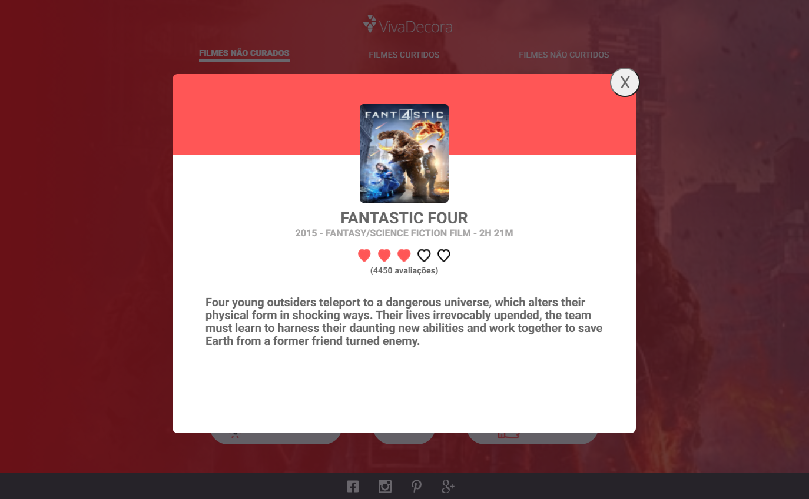

  

  

<h1 align="center">
 <a href="#capturas">Capturas</a> •
 <a href="#roadmap">Roadmap</a> • 
 <a href="#tecnologias">Tecnologias</a> • 
 <a href="#contribuicao">Contribuição</a> • 
 <a href="#licenc-a">Licença</a> • 
 <a href="#autor">Autor</a>
</h1>

<h4 align="center"> 
	Projeto em produção pelo Netlify em: <a href="silly-pare-c55a4b.netlify.app" target="_blank">Curadoria de Filmes - Viva Decora</a>  
</h4>

# Recursos

- [x] Lista filmes da API The Movies Database
- [x] Possibilita curtir, pular e não curtir os filmes
- [x] Possui páginas que listam os filmes curtidos e não curtidos

<h1 id="capturas">
	Capturas de Tela
</h1>

<h4>
	Mobile
</h4>

<h1 align="center" >
  
  
  
  
</h1>

<h4>
	Web
</h4>

<h1 align="center" >
  
  
  
  
</h1>
